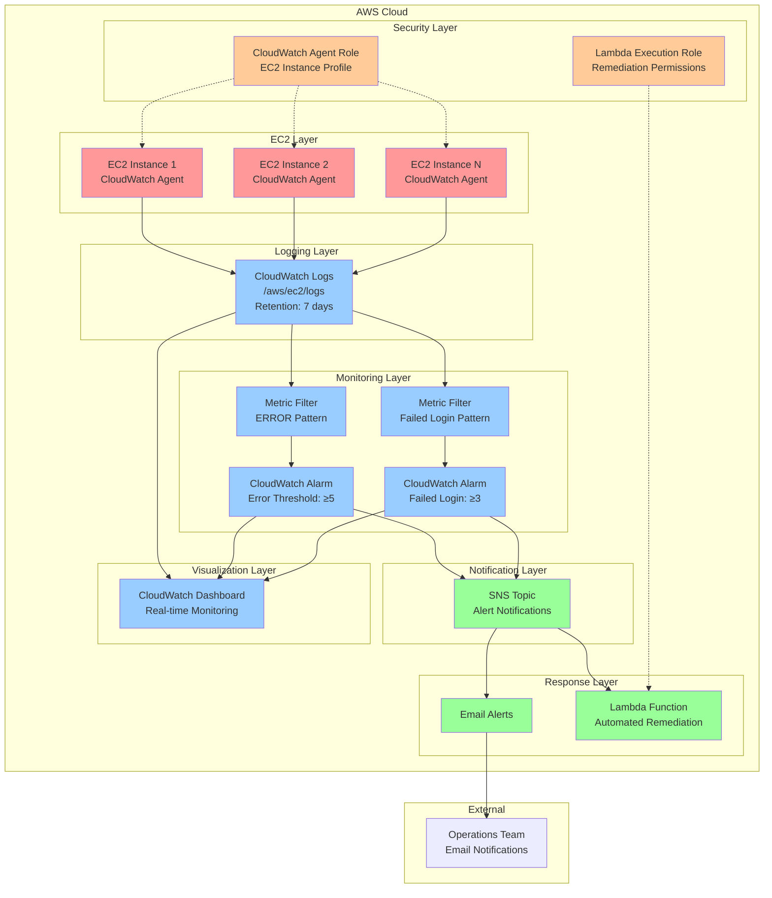
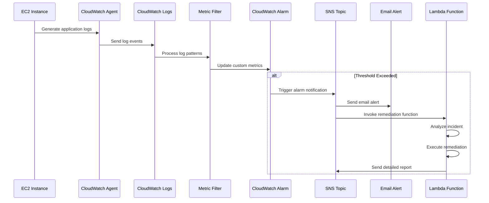
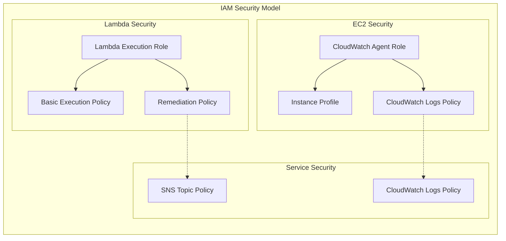
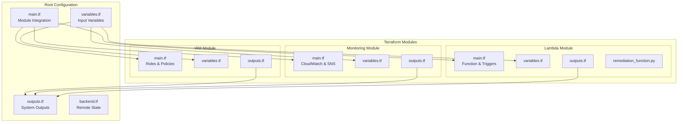

# AWS Log Monitoring System - Visual Architecture

## System Architecture Diagram

## Component Details

### 1. Log Collection (EC2 Layer)
- **EC2 Instances**: Multiple instances running applications
- **CloudWatch Agent**: Installed on each instance to collect logs
- **Log Sources**: Application logs, system logs (/var/log/*), security logs

### 2. Log Storage (Logging Layer)
- **CloudWatch Logs**: Centralized log storage
- **Log Groups**: Organized by application/service
- **Retention Policy**: Configurable (default: 7 days)
- **Encryption**: Optional KMS encryption

### 3. Pattern Detection (Monitoring Layer)
- **Metric Filters**: Real-time log pattern analysis
  - Error Filter: Detects "ERROR" patterns
  - Security Filter: Detects "Failed login" patterns
- **Custom Metrics**: Generated from matched patterns
- **CloudWatch Alarms**: Monitor metric thresholds

### 4. Alert Distribution (Notification Layer)
- **SNS Topic**: Central notification hub
- **Multiple Subscribers**: Email, Lambda, future integrations
- **Message Routing**: Based on alarm type and severity

### 5. Automated Response (Response Layer)
- **Email Notifications**: Immediate alerts to operations team
- **Lambda Function**: Automated incident response
  - Log analysis and correlation
  - Automated remediation actions
  - Detailed incident reporting

### 6. Monitoring Dashboard (Visualization Layer)
- **CloudWatch Dashboard**: Real-time system overview
- **Metrics Visualization**: Error trends, login patterns
- **Log Insights**: Advanced log querying and analysis

### 7. Security (Security Layer)
- **IAM Roles**: Least privilege access control
- **Instance Profiles**: Secure EC2 access to CloudWatch
- **Lambda Execution Role**: Controlled remediation permissions

## Data Flow Sequence

## Security Architecture

## Deployment Architecture

## Cost Optimization Strategy

| Component | Cost Factor | Optimization |
|-----------|-------------|--------------|
| CloudWatch Logs | Log volume & retention | Configurable retention (7-30 days) |
| CloudWatch Metrics | Custom metrics | Efficient metric filters |
| CloudWatch Alarms | Number of alarms | Consolidated alarm strategy |
| SNS | Message volume | Targeted notifications |
| Lambda | Execution time & memory | Optimized function code |
| Data Transfer | Cross-AZ traffic | Regional deployment |

## Scalability Considerations

- **Horizontal Scaling**: Support for multiple EC2 instances
- **Log Volume**: Handles high-volume log ingestion
- **Alarm Scaling**: Configurable thresholds per environment
- **Geographic Distribution**: Multi-region deployment ready
- **Performance**: Sub-minute alert response time